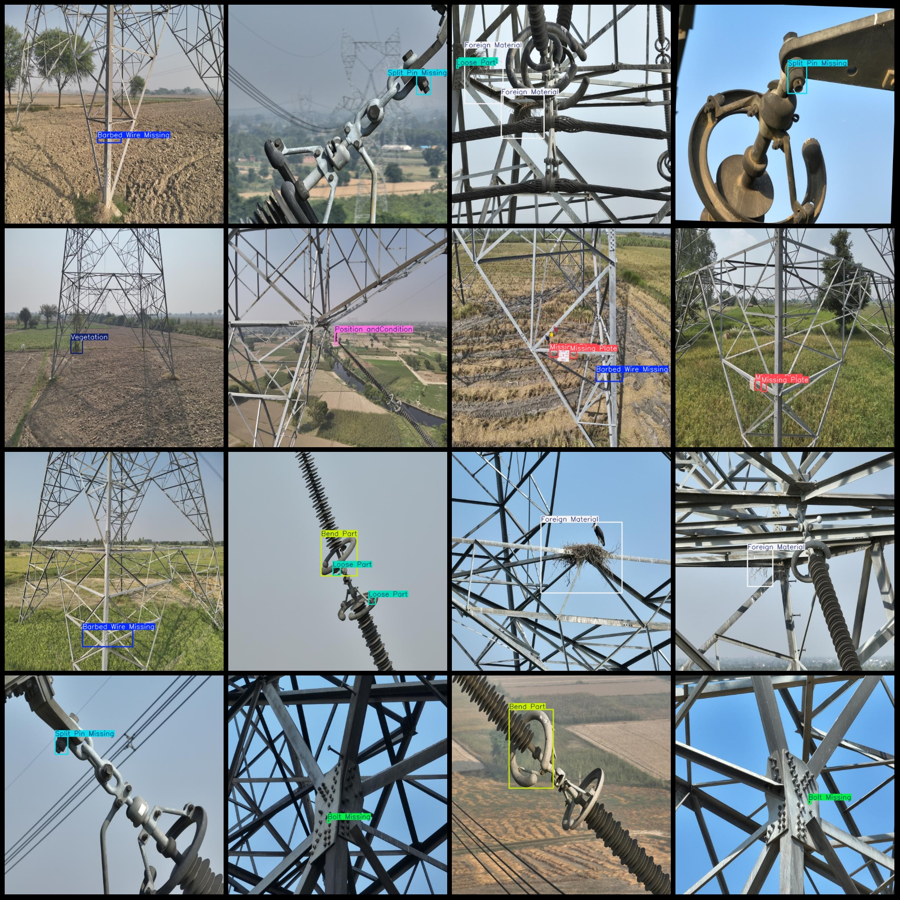
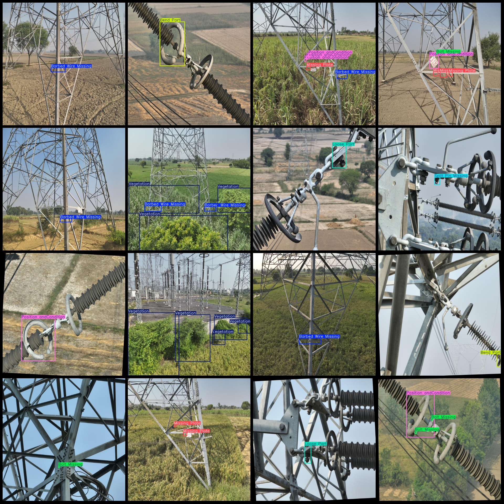

# Power Scenery Transmission Line Defect Detection Dataset in VOC+YOLO Format with 1111 Images and 10 Categories

Pascal VOC format+YOLO format:

1. VOC format (XML file):
```xml
<?xml version="1.0" encoding="UTF-8"?>
<!DOCTYPE image_file [
    <!ELEMENT image_file EMPTY>
    <!ELEMENT image_file_name (#PCDATA)>
    <!ATTRIBUTE href "http://www.cvlibs.net/datasets/VOCdevkit/images/voc_200_2011_VOCdevkit_coco_2017_left_right_JPEG_VOC_imageset_200_2011_VOCdevkit_coco_2017_left_right_TIF_VOC_imageset_200_2011_VOCdevkit_coco_2017_left_right_JPG_VOC_imageset_200_2011_VOCdevkit_coco_2017_left_right_JPEG_VOC_imageset_200_2011_VOCdevkit_coco_2017_left_right_TIF_VOC_imageset_200_2011_VOCdevkit_coco_2017_left_right_JPG_VOC_imageset_200_2011_VOCdevkit_coco_2017_left_right_JPEG_VOC_imageset_200_2011_VOCdevkit_coco_2017_left_right_TIF_VOC_imageset_200_2011_VOCdevkit_coco_2017_left_right_JPEG_VOC_imageset_200_2011_VOCdevkit_coco_2017_left_right_JPEG_VOC_imageset_200_2011_VOCdevkit_coco_2017_left_right_TIF_VOC_imageset_200_2011_VOCdevkit_coco_2017_left_right_JPEG_VOC_imageset_200_2011_VOCdevkit_coco_2017_left_right_JPEG_VOC_imageset_200_2011_VOCdevkit_coco_2017_left_right_TIF_VOC_imageset_200_2011_VOCdevkit_coco_2017_left_right_JPEG_VOC_imageset_200_2011_VOCdevkit_coco_2017_left_right_JPEG_VOC_imageset_200_2011_VOCdevkit_coco_2017_left_right_TIF_VOC_imageset_200_2011_VOCdevkit_coco_2017_left_right_JPEG_VOC_imageset_200_2011_VOCdevkit_coco_2017_left_right_JPEG_VOC_imageset_200_2011_VOCdevkit_coco_2017_left_right_TIF_VOC_imageset_200_2011_VOCdevkit_coco_2017_left_right_JPEG_VOC_imageset_200_2011_VOCdevkit_coco_2017_left_right_JPEG_VOC_imageset_200_2011_VOCdevkit_coco_2017_left_right_TIF_VOC_imageset_200_2011_VOCdevkit_coco_2017_left_right_JPEG_VOC_imageset_200_2011_VOCdevkit_coco_2017_left_right_JPEG

Images: 1111
Annotations (XML): 1111
Annotations (Text): 1111
Number of annotation categories: 10
Annotation category names (Note that the order in yolo format does not correspond to this, but is based on the classes.txt file in the labels folder): ["Barbed Wire Missing", "Bend Part", "Bolt Missing", "Foreign Material", "Loose Part", "Missing Part", "Missing Plate", "Position andCondition", "Split Pin"]
Missing","Vegetation"]

Number of boxes for each category:

Application Fields: These categories are often used for inspection of railways, power facilities or other infrastructure, to detect structural or safety defects.

total boxes: 2179
image resolution: 640x640
Dataset Enhancements: Yes, more than half are data augmentations for images. There are about 450 original images.
Annotation Tool: labelImg
Annotation Rules: Draw a box around the class
Important Notes: None
Special Statement: This dataset does not guarantee any precision on the models or weights file used during training.
Image Preview:
## Images





Here is a pay link on Stripe ( https://buy.stripe.com/3cs8yP7sY87d0vu9AB ). Please contact me lonlonago@foxmail.com after funding $89, and I will send you a complete data files , thank you!

